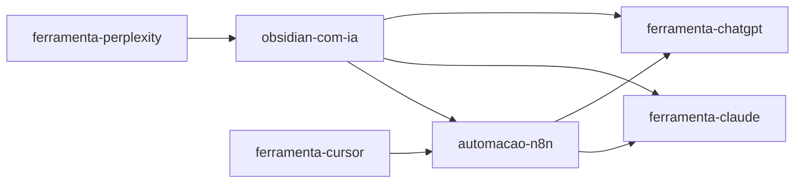

# Sexta-feira, 17 de abril de 2026

## Tarefas do Dia

- [x] Criar todas as 5 notas de pesquisa de ferramentas de IA
- [x] Criar projetos [[obsidian-com-ia]] e [[automacao-n8n]] com status
- [x] Criar notas diárias dos últimos 3 dias com referências cruzadas
- [x] Criar CLAUDE.md com regras do vault
- [ ] Revisar todas as referências cruzadas entre projetos e pesquisas
- [ ] Compartilhar estrutura com a equipe para feedback

## Notas do Dia

Hoje o vault tomou forma. As 5 ferramentas pesquisadas — [[ferramenta-chatgpt]], [[ferramenta-claude]], [[ferramenta-cursor]], [[ferramenta-notion-ai]] e [[ferramenta-perplexity]] — estão documentadas com avaliações e casos de uso claros.

Os dois projetos estão bem posicionados:
- [[obsidian-com-ia]] em **roteiro** — pronto para começar a executar
- [[automacao-n8n]] em **ideia** — precisa de mais validação

> [!success] Marco do dia
> O vault agora tem estrutura, regras claras (CLAUDE.md) e referências cruzadas funcionando entre diários, projetos e pesquisas.

## Mapa de Conexões

## Referências Consultadas

- [[obsidian-com-ia]]
- [[automacao-n8n]]
- [[ferramenta-chatgpt]]
- [[ferramenta-claude]]
- [[ferramenta-cursor]]
- [[ferramenta-notion-ai]]
- [[ferramenta-perplexity]]

## Próxima Semana

- Iniciar execução do roteiro do [[obsidian-com-ia]]
- Validar viabilidade técnica do [[automacao-n8n]]
- Expandir pesquisas com novas ferramentas descobertas
